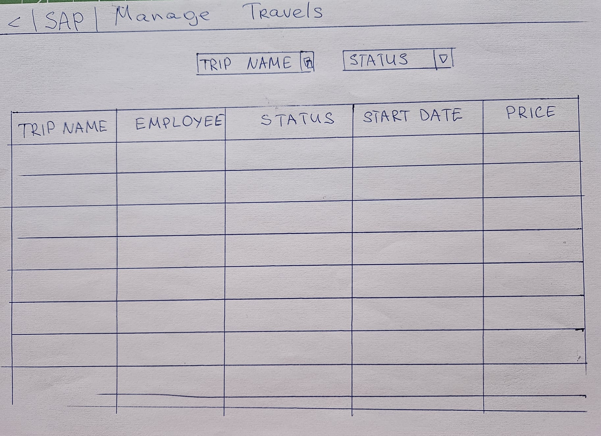
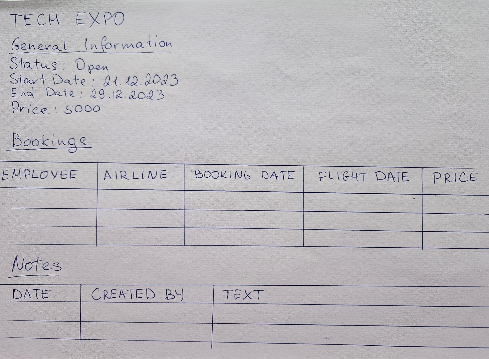

<!-- loiod17b25604ca742ce80fdffeb9ec5a88e -->

# Example: Manage Travel App List Report Object Page

To use this example, create a markdown \(`.md` file\) in your workspace folder in SAP Business Application Studio and copy and paste the sample code below. Then, save the images below with the filename specified in the sample code and upload them to the same directory as the markdown file you created.

> ### Sample Code:  
> Markdown
> 
> ```
> I want to create a travel application that shows a list of trips taken by employees.
> 
> The list of trips should include the following details:
> 
> 
> 
> Each trip can have many bookings and multiple notes. On the travel details page, the app should show:
> 
> 
> 
> The total trip price should equal the price of all the bookings for that trip. If there are no bookings for a trip, the total trip price should be zero.
> 
> If there are any bookings associated with a trip, then each booking must cost more than zero.
> 
> Clicking on a booking should allow the user to see more details.
> ```





