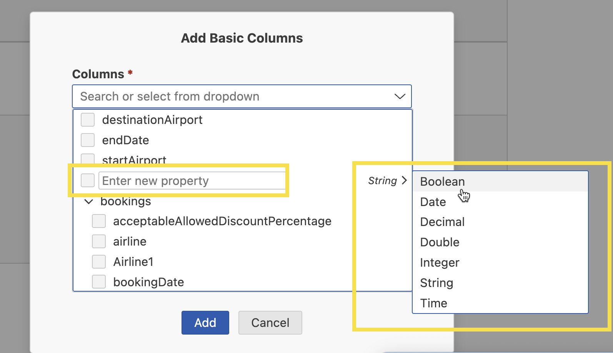

<!-- loio418d583162794b3ab0e18ff72df75b92 -->

<link rel="stylesheet" type="text/css" href="css/sap-icons.css"/>

# Experimental: Developing an Application Using Advanced Features

Learn how to develop an application in a CAP project generated with the Project Accelerator using advanced features of application modeler.

Application modeler offers advanced features you can use to develop applications generated with the Project Accelerator.

> ### Caution:  
> Experimental features are not part of the officially delivered scope that SAP guarantees for future releases. This means that experimental features may be changed by SAP at any time for any reason without notice. Experimental features are not for productive use. You must not demonstrate, test, examine, evaluate or otherwise use experimental features in a live operating environment or with data that has not been sufficiently backed up.

> ### Tip:  
> When service and database schema files have been updated outside of Application Modeler, except for formatting changes such as adding empty lines, advanced features are turned off.

<a name="loio418d583162794b3ab0e18ff72df75b92__section_c3q_vw3_42c"/>

## Add UI Features and Auto-Generate New Entity Properties

When using the Page Editor to add new UI features or configure properties, the database and service may not contain the required entity properties.

You can enter the name for a new property and it is auto-generated for you in the `db/schema.cds` file along with the UI feature or property you configure.

To auto-generate an entity property for a new table column, for example, perform the following steps:

1.  Open the *Page Editor* and add a new column. For more information, see [Maintaining Annotation-Based Elements](Developing-an-Application/maintaining-annotation-based-elements-a524d8a.md).
2.  In the *Columns* dropdown, click the *Enter new property* field and enter a value.
3.  \(Optional\) Click *String* to set a different type for your property.
4.  Click *Add*.

A new column is added to your table and the related `.csv` file is also updated with the generic mock data corresponding to the selected property type.

You can then refine the generic mock data to match your application context. For more information, see [Generate Mock Data with AI](experimental-developing-an-application-using-advanced-features-418d583.md#loio418d583162794b3ab0e18ff72df75b92__refine_test_data_with_ai).

<a name="loio418d583162794b3ab0e18ff72df75b92__section_ocj_xw3_42c"/>

## Add Tables and Charts and Auto-Generate New Entities

When using the Page Editor to add an analytical chart, table or chart views in a list report page, or table or chart sections in an object page, the database and service may not contain the required 1:n entity.

You can enter the name for a new entity and it is auto-generated for you in the `db/schema.cds` file with the `UUID` property along with the UI feature you configure. It is also referenced in the `srv/service.cds` file and a new `.csv` file is also auto-generated.

If you add a chart-based element, the newly-generated entity is also annotated with the `@Aggregation.ApplySupported` annotation, where the property you chose as the `Dimension` is referenced in `GroupableProperties` and the property you chose as the measure in `AggregatableProperties`.

To auto-generate an entity property for a new table column, for example, perform the following steps:

1.  Open the *Page Editor* and add a new chart view. For more information, see [Maintaining Annotation-Based Elements](Developing-an-Application/maintaining-annotation-based-elements-a524d8a.md).
2.  In the *Entity* dropdown, click the *Enter new entity* field and enter a value.
3.  Select a *Chart Type*.
4.  In the *Dimension* dropdown, click the *Enter new property* field and enter a value.
5.  \(Optional\) Click *String* to set a new type for your property.
6.  Select *Create new measure*.
7.  In the *Property* dropdown, click the *Enter new property* field and enter a value.
8.  \(Optional\) Click *Integer* to set a different type for your property.
9.  Select an *Aggregation Method*.
10. Click *Add*.

Your new chart view is added based on the newly-generated entity. The entity is added to the `db/schema.cds` file with the `UUID` property and the properties you created for the measure and dimension. It is also referenced in the `srv/service.cds` file where it is annotated with the `@Aggregation.ApplySupported` annotation. The new `.csv` file is also auto-generated in the `test/data` folder and contains generic mock data for the UUID, measure, and dimension properties.

<a name="loio418d583162794b3ab0e18ff72df75b92__section_usj_yw3_42c"/>

## Add Value Help and Auto-Generate New Entities

When using the Page Editor, you can add value help to fields and filters even when the database and service do not contain the appropriate entity.

To auto-generate a 1:1 associated entity for value help, perform the following steps:

1.  In the *Page Editor* for an object page, search for `display type`.
2.  Set *Display Type* to *Value Help*.
3.  In the *Value Source Entity* dropdown, click the *Enter new entity* field and enter a name for the new entity.
4.  In the *Value Source Property* dropdown, click the *Enter new property* field and enter a value.
5.  \(Optional\) In the *Value Description Property* dropdown, click the *Enter new property* field and enter a value.
6.  \(Optional\) If you set a value for the *Value Description Property*, you can also set a value for *Text Arrangement*.
7.  \(Optional\) You can switch *Display as Dropdown* on and off as needed.
8.  \(Optional\) Click *Add Column* under *Results List* and in the *Property* dropdown, click the *Enter new property* field and enter a value to show additional information in the value help. Click *String* to set a new type for your property.

    > ### Restriction:  
    > You cannot choose the UUID type when defining properties for value help.

9.  \(Optional\) Click *Add Sort Property* under *Sort Order* and in the *Add Sort Property* dropdown, choose the property to be used for sorting the results lists.
10. Click *Apply*.

Your application is updated as follows:

-   The new entity and the properties you chose to create in the value help dialog are generated. Note: The generated entity used for the value help does not contain the UUID property.
-   The 1:1 association to the newly created entity is added to the entity of the initial field or filter.
-   The annotations required for the value help are generated.
-   The initial property is replaced with navigation to the key field of the new associated entity in the annotations and `manifest.json` file.
-   The mock data matching the values in the main entity are auto-generated for the key property of the new entity and generic data is generated for the remaining properties.

You can then re-generate the generic mock data to match your application context. For more information, see [Generate Mock Data with AI](experimental-developing-an-application-using-advanced-features-418d583.md#loio418d583162794b3ab0e18ff72df75b92__refine_test_data_with_ai).

<a name="loio418d583162794b3ab0e18ff72df75b92__refine_test_data_with_ai"/>

## Generate Mock Data with AI

You can re-generate the generic mock data you have auto-generated to provide meaningful values using AI. To generate mock data with AI, perform the following steps:

1.  In the *Page Editor*, click the  \(*Generate Mock Data with AI*\) icon.
2.  Click *Generate*.

Your generic mock data is refined to provide meaningful values for your application context.

