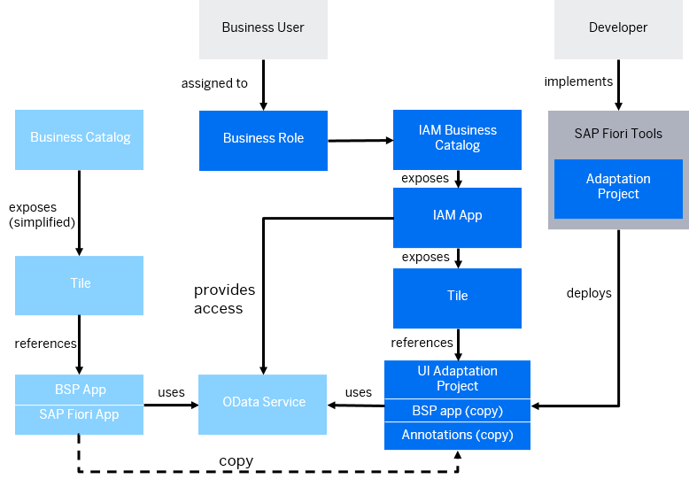

<!-- loiof4881a9b9141430dba1c6a76e7f456dc -->

# Extending an SAP Fiori Application for SAP S/4HANA Cloud Public Edition and SAP BTP, ABAP Environment

You can use an SAPUI5 Adaptation Project to extend SAP Fiori elements or freestyle SAPUI5 applications with an application variant.

<a name="loiof4881a9b9141430dba1c6a76e7f456dc__section_lnk_cmx_pxb"/>

## Overview

You can extend SAPUI5 applications in SAP S/4HANA Cloud Public Edition and SAP BTP, ABAP Environment with an application variant without changing the original application.

<a name="loiof4881a9b9141430dba1c6a76e7f456dc__section_lvj_pyl_qxb"/>

## Prerequisites

-   SAP S/4HANA Cloud only: To determine if the application can be extended using the adaptation project, see [SAP Fiori Apps Reference Library](https://fioriappslibrary.hana.ondemand.com/sap/fix/externalViewer/#/homePage) and check the application’s implementation information under Extensibility \(extensibility of the SAPUI5 application in the front-end server\).

-   SAP S/4HANA Cloud only: If the SAP delivered application you want to extend with an adaptation project is not supported, please submit a request here: [Influence Opportunity Homepage - Customer Influence](https://influence.sap.com/sap/ino/#/campaign/1177).
-   SAP S/4HANA Cloud only: Since a developer tenant is required, this feature is only available with a 3-system landscape. For more information, see [System Landscapes in SAP S/4HANA Cloud](https://help.sap.com/docs/SAP_S4HANA_CLOUD/a630d57fc5004c6383e7a81efee7a8bb/aa60b129af7b4ce8ae052618c8315d29.html).
-   [Releasing an SAP Fiori Application to Be Extensible in Adaptation Projects on SAP S/4HANA Cloud and SAP BTP, ABAP Environment](releasing-an-sap-fiori-application-to-be-extensible-in-adaptation-projects-on-sap-s-4hana-1046206.md).
-   A destination for the development tenant exists. For more information, see [Create a Destination to Connect to SAP Business Application Studio](https://help.sap.com/docs/SAP_S4HANA_CLOUD/6aa39f1ac05441e5a23f484f31e477e7/0af2819bbe064a3da455753c8518dd81.html).
-   The developer requires the following business catalogs: The application that will be adapted must be released for extensibility using adaptation projects. For more information, see:
    -   Development - UI Deployment \(SAP\_A4C\_BC\_DEV\_UID\_PC\)
    -   Business catalog to retrieve the list of extensible apps \(for example SAP\_A4C\_BC\_DEV\_OBJ\_DIS\_PC\)

<a name="loiof4881a9b9141430dba1c6a76e7f456dc__section_jj3_gzp_d1c"/>

## Context

The following diagram shows the relationship between the source application \(shown in light blue\) and the application variant created by adaptation project \(shown in dark blue\).

> ### Note:  
> The application that will be adapted must be released for extensibility using adaptation. You can use source control, such as Git, to maintain your project source code.
> 
> You must use the project source code to preview and modify it. For more information, see [Git Source Control](https://help.sap.com/docs/bas/sap-business-application-studio/git-source-control).

